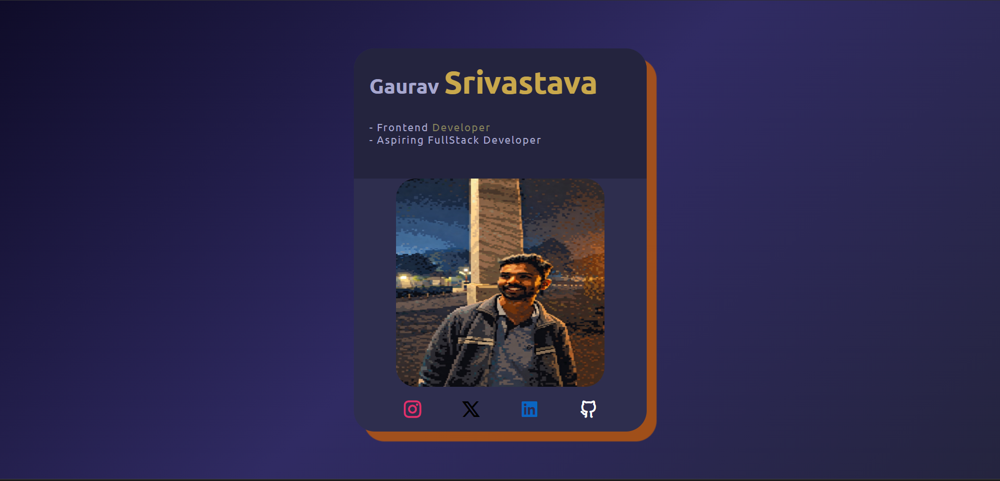

<div align="center">

<!-- Animated Header -->


<!-- Live Badge -->
<a href="https://gaurav-e-card.netlify.app">
  
</a>

&nbsp;


</div>

---

## ✨ About

A clean, responsive **digital business e-card** built with pure HTML & CSS. Designed to be shared across social platforms as a personal introduction card.

> 🚧 **Work in progress** — actively improving with more features coming soon!

---

## 🖥️ Preview

<div align="center">
  
</div>

---

## 🌟 Features

- ✅ Fully responsive — works on all screen sizes
- ✅ Social media links — Instagram, X, LinkedIn, GitHub
- ✅ Clean dark theme with gold accents
- ✅ Deployed and live on Netlify
- ✅ Pure HTML & CSS — no frameworks

---

## 🛠️ Built With

| Technology | Usage |
|---|---|
| HTML5 | Structure & layout |
| CSS3 | Styling, gradients, responsiveness |
| Remix Icons | Social media icons |
| Google Fonts (Ubuntu) | Typography |
| Netlify | Deployment |

---

## 🚀 Getting Started

```bash
# Clone the repo
git clone https://github.com/your-username/E-Card.git

# Open in browser
open index.html
```
No dependencies. No build tools. Just open and run! ⚡

---

## 📁 Project Structure

```
E-Card/
├── index.html        # Main HTML file
├── style.css         # All styles
├── Profile-photo.jpeg # Profile image
└── README.md         # You are here
```

---

## 🔮 Upcoming Improvements

- [ ] Hover animations on social icons
- [ ] Flip card effect
- [ ] Download contact / vCard button
- [ ] Dark / Light mode toggle
- [ ] More responsive breakpoints

---

## 🔗 Live Demo

👉 **[gaurav-e-card.netlify.app](https://gaurav-e-card.netlify.app)**

---

<div align="center">


**Made with 💛 by Gaurav Srivastava**

⭐ Star this repo if you found it helpful!

</div>
